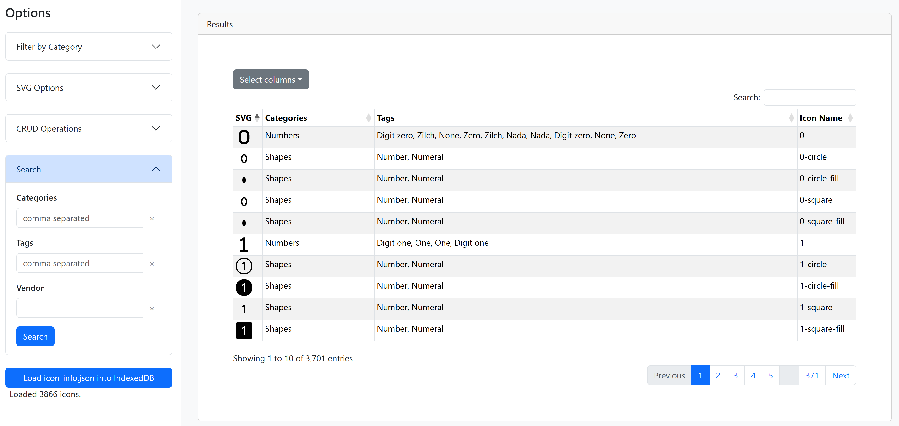
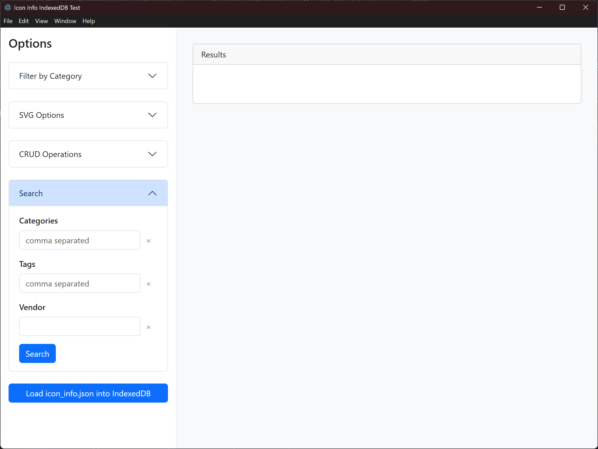

# USER-HOWTO (사용자 가이드)

이 문서는 `index-test.html` 아이콘 검색 도구의 사용법을 안내합니다.

---

## 1. index-test.html 실행 방법

### 1.1 웹 브라우저에서 실행
- `index-test.html` 파일을 더블클릭하거나, 크롬/엣지/파이어폭스 등 웹 브라우저에서 열면 바로 사용 가능합니다.
- 일부 기능(IndexedDB, 파일 접근 등)은 최신 브라우저에서 정상 동작합니다.
- 예시 화면:
  

### 1.2 윈도우 실행파일(EXE)로 실행
- `bootstrap-icon-finder-win32-x64/bootstrap-icon-finder.exe` 파일을 더블클릭하여 실행합니다.
- 별도의 설치 없이 바로 데스크탑 앱처럼 사용 가능합니다.
- 예시 화면:
  

---

## 2. 아이콘 검색 방법

### 2.1 카테고리로 검색
- 왼쪽 사이드바의 "카테고리로 필터"(Filter by Category) 아코디언을 펼칩니다.
- 원하는 카테고리(토글 버튼)를 클릭하면 해당 카테고리에 속한 아이콘만 결과에 표시됩니다.
- 다중 선택도 가능합니다.
- 언어 버튼(English/한국어)으로 카테고리명을 한글/영어로 전환할 수 있습니다.
- 예시 화면:
  

### 2.2 태그(Tag)로 검색
- 사이드바의 "Search" 아코디언에서 "Tags" 입력란에 원하는 태그(예: Number, Arrow 등)를 입력합니다.
- 쉼표(,)로 여러 태그를 입력할 수 있습니다.
- 입력 후 Search 버튼을 누르면 해당 태그가 포함된 아이콘만 결과에 표시됩니다.
- 부분 문자열(예: "arr" 입력 시 "arrow" 포함 아이콘 검색)도 지원합니다.
- 예시 화면:
  

### 2.3 벤더(Vendor)로 검색
- "Search" 아코디언의 "Vendor" 입력란에 벤더명(예: bi, fa 등)을 입력합니다.
- 입력 후 Search 버튼을 누르면 해당 벤더의 아이콘만 결과에 표시됩니다.
- 예시 화면:
  

---

## 3. 설정 및 기타 기능

- **SVG 옵션**: 사이드바의 "SVG Options" 아코디언에서 아이콘 미리보기의 크기(px)와 색상(컬러)을 변경할 수 있습니다.
  
- **컬럼 선택**: 결과 테이블 상단의 "Select columns" 버튼으로 표시할 컬럼을 선택할 수 있습니다.
  
- **SVG 복사**: 결과 테이블의 SVG 이미지를 클릭하면 PNG로 변환되어 클립보드에 복사됩니다. 복사 성공 시 미리보기와 안내 모달이 표시됩니다.
  
- **검색 입력 초기화**: 각 검색 입력란 옆의 X(지우기) 버튼으로 입력값을 빠르게 초기화할 수 있습니다.
  
- **데이터 로드**: "Load icon_info.json into IndexedDB" 버튼을 누르면 최신 아이콘 정보를 불러올 수 있습니다.
  

---

더 궁금한 점은 개발자에게 문의해 주세요.
